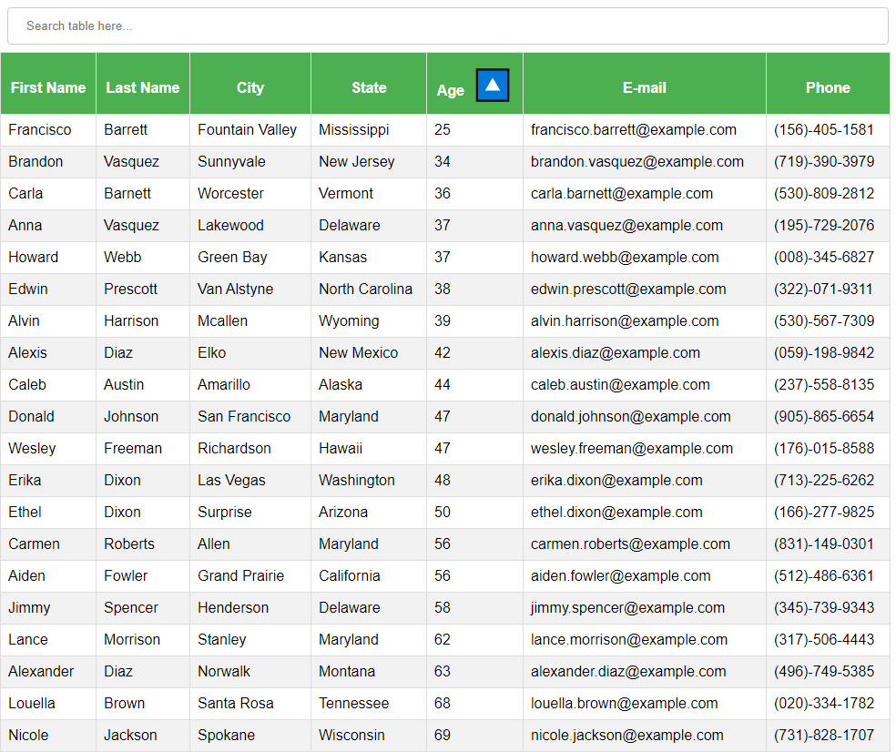

# **Employee Directory**

[](#) [](#) [](#)

### :rocket: **Deployed on Heroku**

https://dragontalker.github.io/react-employee-directory/

---

### **Table of Contents**

- [Description](#description)
- [How to Use](#how-to-use)
- [How to Install](#how-to-install)
- [License](#license)
- [Author Info](#author-info)

# Description

`React` is the most popular front-end technology right now. This React application is to demonstrate its power of fast dynamic rendering. The table is dynamatically updated whenever user types in something in search bar, no button clicking is required. Moreover, user can sort each column by clicking on the header, either in ascending order or descending order.

## :wrench: **Technologies Used**

- React
- React Hooks
- Node.js
- RESTful Api
- Axios
- HTML 5
- CSS 3
- JavaScript
- VS Code
- GitHub Pages

[Back to the Top](#employee-directory)

## **Screenshot of Deployed React Application**


---

### **User Story**

- As a user, I want to be able to view my entire employee directory at once so that I have quick access to their information.

---

### **Business Context**

An employee or manager would benefit greatly from being able to view non-sensitive data about other employees. It would be particularly helpful to be able to filter employees by name.

---

### **Acceptance Criteria**

Given a table of random users generated from the [Random User API](https://randomuser.me/), when the user loads the page, a table of employees should render.

The user should be able to:

- Sort the table by at least one category

- Filter the users by at least one property.

---

### **Installation**

For local installtion, please type in the following command in console:

```bash
npm install
```

After installtion completed, use the following commander to start react app:

```bash
npm start
```

---

### **Usage**

#### **1. Filtering**

This application has a built-in global filter, basically type in anything you want to search and it will filter the table for you.


---

#### **2. Sorting**

Click on the header to select sorting mode, the direction of the triangle indicates the sorting order.

###### **Example 1: Sorting age in asceding order:**



###### **Example 2: Sorting city in descending order:**


---

### **Contact**

If you have any questions, email me at richard.yang.tong@gmail.com.

### **License**

Copyright (c) [2021] [Richard Yang]

Permission is hereby granted, free of charge, to any person obtaining a copy of this software and associated documentation files (the "Software"), to deal in the Software without restriction, including without limitation the rights to use, copy, modify, merge, publish, distribute, sublicense, and/or sell copies of the Software, and to permit persons to whom the Software is furnished to do so, subject to the following conditions:

The above copyright notice and this permission notice shall be included in all copies or substantial portions of the Software.

THE SOFTWARE IS PROVIDED "AS IS", WITHOUT WARRANTY OF ANY KIND, EXPRESS OR IMPLIED, INCLUDING BUT NOT LIMITED TO THE WARRANTIES OF MERCHANTABILITY, FITNESS FOR A PARTICULAR PURPOSE AND NONINFRINGEMENT. IN NO EVENT SHALL THE AUTHORS OR COPYRIGHT HOLDERS BE LIABLE FOR ANY CLAIM, DAMAGES OR OTHER LIABILITY, WHETHER IN AN ACTION OF CONTRACT, TORT OR OTHERWISE, ARISING FROM, OUT OF OR IN CONNECTION WITH THE SOFTWARE OR THE USE OR OTHER DEALINGS IN THE SOFTWARE.
